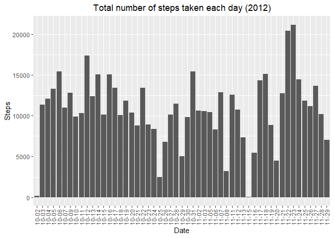

```r
library(ggplot2)
```

## Loading and preprocessing the data


```r
activityDT<-read.csv(file = './activity.csv')
```
## What is mean total number of steps taken per day?


```r
stepsMean <- aggregate(steps ~ date, FUN = mean, data = activityDT, na.rm = TRUE)
dateClean <- gsub("2012-","", stepsMean$date)
g <- ggplot(stepsMean, aes(x = dateClean, y = steps))+ 
            geom_histogram(stat = "identity") +
            ggtitle("Average steps taken per day (2012)") +
            theme(plot.title = element_text(hjust = 0.5), axis.text.x = element_text(angle = 90, vjust = 0.5, hjust=1)) +
            xlab("Date") + ylab("Steps")
```

```
## Warning: Ignoring unknown parameters: binwidth, bins, pad
```

```r
print(g) 
```

<!-- -->

```r
median(stepsMean$steps)
```

```
## [1] 37.37847
```

```r
mean(stepsMean$steps)
```

```
## [1] 37.3826
```


## What is the average daily activity pattern?


## Imputing missing values


## Are there differences in activity patterns between weekdays and weekends?
